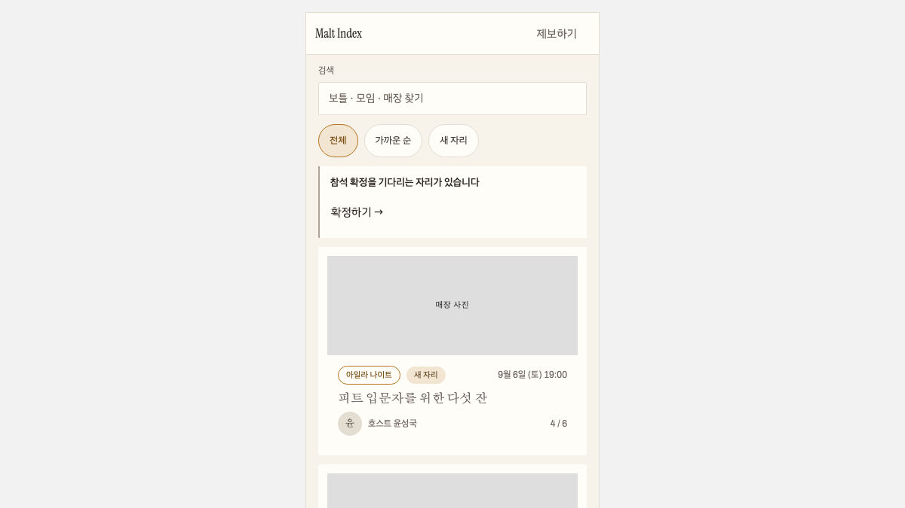

# MODUL

[한국어](README.md) | **English**

[Storybook demo](https://modul-storybook.vercel.app) · [GitHub](https://github.com/gook-lab/modul)

[](https://github.com/gook-lab/modul/actions/workflows/verify.yml)

The verification workflow checks types, tests, bundle budgets, and axe accessibility across every Storybook story.

A React component library that separates behavior from presentation so each product can apply its own visual language. Design values ship as CSS variables, while native attributes and application-level styling remain available to consumers.



```bash
# @gook-lab/* lives on GitHub Packages. Consumers need one line in .npmrc.
echo '@gook-lab:registry=https://npm.pkg.github.com' >> .npmrc
pnpm add @gook-lab/ui @gook-lab/tokens
```

The `@modul` scope belongs to another organization (ModulBank), so the packages cannot be published under that name. Installing needs a GitHub token with `read:packages`.

```tsx
import { Button } from '@gook-lab/ui';
import '@gook-lab/tokens/styles.css';

<Button variant="primary" type="submit" form="contact" data-testid="cta">
  Send
</Button>
```

`type`, `form`, `data-*`, `aria-*`, and event handlers reach the root element. Products can add the behavior and accessibility attributes they need without another wrapper.

## Packages — four core, one domain

| Package | What | Size |
| --- | --- | --- |
| `@gook-lab/tokens` | CSS variables. light · dark · malt, three themes | 6.7 KB css (gzip) |
| `@gook-lab/ui` | Headless components, 51 exports | 27.4 KB (gzip, all) |
| `@gook-lab/motion` | 19 motion hooks and components, 8 presets | 1.54 KB (gzip, hooks + Marquee/Reveal) |
| `@gook-lab/icons` | Lucide re-exports with a size scale | — |
| `@gook-lab/malt-ui` | Seven primitives for the whisky app. Not promoted into core | — |

Sizes come from `npx size-limit`; the budgets live in [`.size-limit.json`](./.size-limit.json).

## Design principles

The originals and their reasoning are in [`PROMPT.md`](./PROMPT.md). In short:

**1. Headless — props are never restricted.** Every component is `own props + ...rest` and forwards a ref. `NativeProps<E, Own>` omits only the native attributes whose names collide with own props. An intersection (`Own & ComponentPropsWithoutRef<'div'>`) turns `children`, `onChange`, and `title` into the intersection of two types, which is not callable.

**2. `className` comes last, `!` is the override rule.** Class names are assembled with `cx()` only.

```
cx('btn', 'btn-primary', '!btn-ghost')            → 'btn btn-ghost'
cx('btn', 'btn-primary', 'btn-sm', '!btn-ghost')  → 'btn btn-sm btn-ghost'
```

Same group, different axis, and the class survives. Dropping the size when you override a variant would force consumers to restate it. All of `components.css` sits inside `@layer modul`, so app CSS outside the layer wins regardless of specificity.

**3. Tokens only.** Colors, fonts, spacing, radii, and motion are all `var(--*)`. Hex, px, and font-name literals are blocked by ESLint. [`theme.json`](./packages/tokens/theme.json) is the single source for base values (per-theme bg, surface, text, accent, plus fonts, radius, spacing, motion, easing); the build validates it with a zod schema and then compares it against the shipped CSS, failing on any mismatch. Ramps (neutral-100..900, accent-100..900) are not generated — they are hand-tuned, and the measured contrast audit and the axe pass depend on those exact values, so regenerating them algorithmically would invalidate the audit.

**4. Motion comes from presets only.** No duration or easing outside `tap`, `reveal`, `move`, `page`, `spring`, `loop`, `count`, `scrub`. Only `transform`, `opacity`, and `clip-path` animate. The `prefers-reduced-motion` fallback lives in each preset's `reduced`, so components do not branch on it.

**5. What components do not know.** No fetching, uploading, routing, or validation inside a component. Boundaries arrive as callbacks such as `onUpload(file, onProgress) => Promise<url>`. Form state belongs to react-hook-form and zod.

**6. Accessibility floor.** 44px touch targets (the Malt theme enforces it on `.btn`), focus is a 2px accent ring on `:focus-visible` only. `--color-neutral-600` is not used for 11–12px text. Korean IME input goes through `guardIme()`, and overlays use the native `<dialog>` with `showModal()` so the browser owns focus trapping, Esc, and focus return.

## Tree shaking — one entry per component

Importing `Button` alone does not pull in Radix.

| Measured | Budget | Actual |
| --- | --- | --- |
| `{ Button, Input, Tag, Card }` | 4 KB | 1.83 KB |
| `@gook-lab/ui`, everything (MODUL code) | 30 KB | 27.4 KB |
| `@gook-lab/ui`, everything (with Radix) | 74 KB | 71.42 KB |

Bundling through a single barrel collects every `import * as RTabs from '@radix-ui/react-tabs'` at the top of `dist/index.js`. Radix, cmdk, and react-day-picker do not declare `sideEffects: false`, so a bundler cannot drop those statements and `Button` alone costs 47 KB. Splitting the `tsup` entries per component leaves the barrel as re-exports only.

## Component design documentation

Read a component's RADIO before changing it: R (requirements with numbers), A (structure and state ownership), D (data model), I (interface), O (performance and observability).

| Document | What |
| --- | --- |
| [`docs/radio/`](./docs/radio/) | 44 per-component design docs. New components start from [`TEMPLATE.md`](./docs/radio/TEMPLATE.md) |
| [`docs/cx-audit.md`](./docs/cx-audit.md) | The `!` rule and its exceptions |
| [`docs/contrast-audit.md`](./docs/contrast-audit.md) | Color constraints with measured contrast ratios |
| [`docs/performance-budget.md`](./docs/performance-budget.md) | Bundle, DOM node, and INP budgets |
| [`docs/migration-bottling.md`](./docs/migration-bottling.md) | A 12-step codemod for moving an existing app over |
| [`PROMPT.md`](./PROMPT.md) | The contracts in full, and the build order |
| `Storybook.dc.html` | Visual reference. Opens directly in a browser |

Consumer-side rules live in the [guk-lab-docs playbook](https://github.com/gook-lab/guk-lab-docs/blob/main/playbooks/modul-design-system.md), and the rules agents follow inside this repository are in [`.claude/rules/modul-ui.md`](./.claude/rules/modul-ui.md).

## Example apps — two screens to assemble against

These exist to show what is missing once the library is actually wired into a screen. They reference workspace sources directly, so a library edit only needs a refresh.

```bash
pnpm --filter @gook-lab/app-admin dev        # 11 form components assembled, Table, server error flow
pnpm --filter @gook-lab/app-portfolio dev    # motion wrappers, Reveal, Marquee
```

The two Malt screens (F4 feed, F5 shop detail) live under `Domain/Malt 화면` in Storybook. They are assembled from core and domain primitives with no new components, and that assembly is what surfaced the `.card-body` opacity problem.

## Development and verification

```bash
pnpm install
pnpm --filter @gook-lab/tokens build          # theme.json ↔ CSS check + tokens.ts
pnpm --filter @gook-lab/storybook dev         # localhost:6006, three-theme toggle
```

```bash
pnpm typecheck                             # 0 errors
pnpm lint                                  # 0 errors
pnpm -r test                               # all package tests
pnpm -r build                              # 4 packages
npx size-limit                             # within budget
pnpm --filter @gook-lab/storybook build
pnpm --filter @gook-lab/storybook test:a11y   # axe across all stories
```

```bash
pnpm --filter @gook-lab/storybook test:visual # all-story screenshot comparison (baselines are per-OS)
```

Accessibility and visual-regression checks render each story in Storybook 10's Vitest browser mode. Because font rasterization differs by operating system, visual regression remains a local pre-release check rather than a required CI job. `pnpm gen:stories` creates stories from RADIO documents and prop types while preserving hand-written stories. The latest result and CI sequence live in the [verification workflow](./.github/workflows/verify.yml).

## Publishing — pnpm only

```bash
pnpm changeset      # change summary and version bump
pnpm release        # version, build, publish
```

`npm publish` is blocked by a `prepack` guard. Only pnpm rewrites the `workspace:*` in peerDependencies into a real version; published through npm, consumers fail to install with `EUNSUPPORTEDPROTOCOL` (measured). Publishing without a build is blocked by each package's `prepublishOnly` — without it, deleting `dist` and packing shipped a 1-file, 1.8 KB package.

## Status

`0.1.0`. Button, Input, Tag, Card, Table, Modal, and Toast are stable; everything else is beta. Versions are managed with changesets, and `ui`, `motion`, and `tokens` move together as a fixed group.
